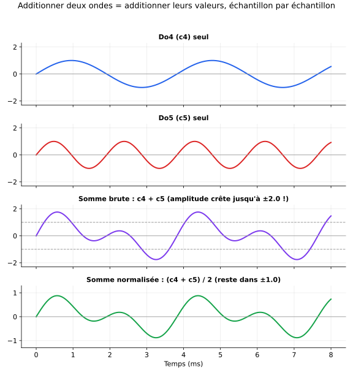
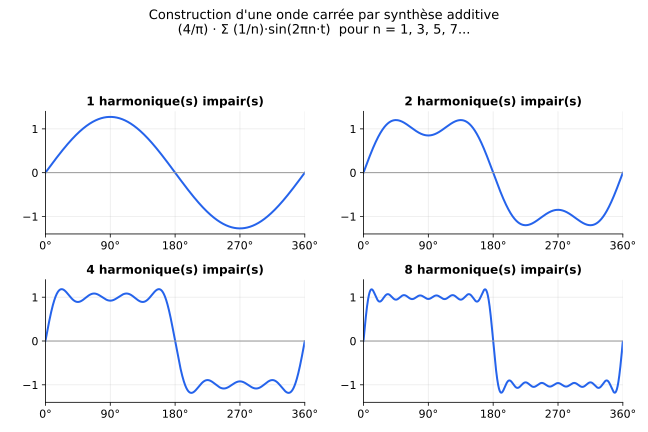
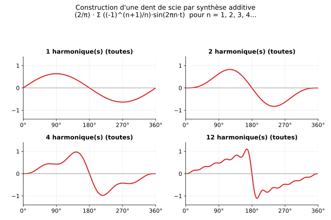
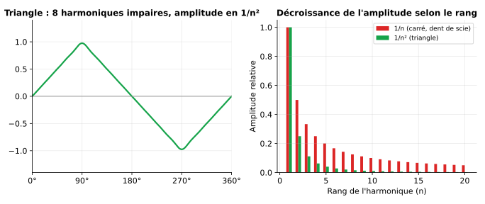
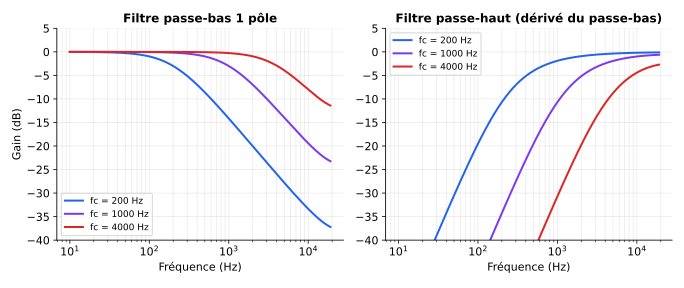
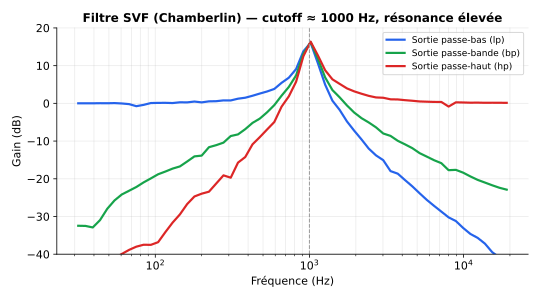
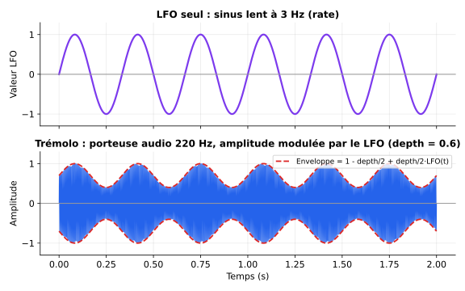
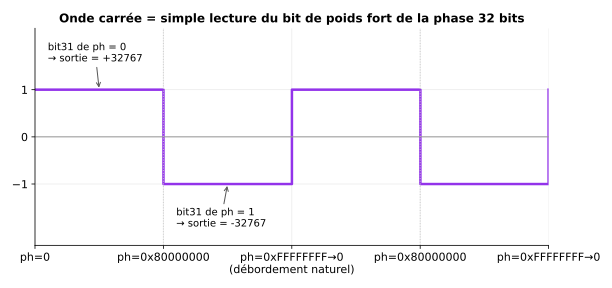

# 📐 Comprendre le mélange d'ondes, les filtres et les LFO

Ce document est un support **théorique** : pas de code prêt à copier-coller, mais les principes et les formules nécessaires pour que tu puisses ensuite écrire toi-même tes wavetables, tes filtres et tes modulations avec ESP32Synth (ou n'importe quel autre moteur audio). Chaque section renvoie vers les mécanismes de la bibliothèque déjà documentés dans `01_Guide_API.md` pour faire le lien entre théorie et implémentation.

## Sommaire

1. [Onde périodique, fréquence, harmoniques : les bases](#1-onde-périodique-fréquence-harmoniques--les-bases)
2. [La synthèse additive : l'idée centrale](#2-la-synthèse-additive--lidée-centrale)
   - [2.1 Concrètement : comment "n'obtenir qu'une seule onde" à partir de deux ?](#21-concrètement--comment-nobtenir-quune-seule-onde-à-partir-de-deux-)
3. [Construire un carré, une dent de scie, un triangle à partir de sinus](#3-construire-un-carré-une-dent-de-scie-un-triangle-à-partir-de-sinus)
4. [Écrire ta propre wavetable par synthèse additive](#4-écrire-ta-propre-wavetable-par-synthèse-additive)
5. [Piège à connaître : le repliement spectral (aliasing)](#5-piège-à-connaître--le-repliement-spectral-aliasing)
6. [Les filtres : qu'est-ce que ça fait réellement ?](#6-les-filtres--quest-ce-que-ça-fait-réellement-)
7. [Le filtre le plus simple : le passe-bas à 1 pôle](#7-le-filtre-le-plus-simple--le-passe-bas-à-1-pôle)
8. [Le passe-haut : le complément du passe-bas](#8-le-passe-haut--le-complément-du-passe-bas)
9. [Le filtre résonant multi-mode (SVF) : passe-bas + passe-bande + passe-haut en un seul calcul](#9-le-filtre-résonant-multi-mode-svf--passe-bas--passe-bande--passe-haut-en-un-seul-calcul)
10. [Le LFO : moduler un paramètre dans le temps](#10-le-lfo--moduler-un-paramètre-dans-le-temps)
11. [Exemple pratique : une onde carrée en `WAVE_CUSTOM`, sans aucune division](#11-exemple-pratique--une-onde-carrée-en-wave_custom-sans-aucune-division)
12. [Où brancher tout ça dans ESP32Synth](#12-où-brancher-tout-ça-dans-esp32synth)

---

## 1. Onde périodique, fréquence, harmoniques : les bases

Une onde **périodique** se répète à l'identique après un certain temps, appelé sa **période** (T, en secondes). Sa **fréquence fondamentale** est l'inverse de cette période : `f = 1 / T` (en Hz). C'est la hauteur (pitch) que tu perçois quand tu joues une note.

Un **harmonique de rang n** est une sinusoïde dont la fréquence est un multiple entier de la fondamentale : `f_n = n × f`. L'harmonique de rang 1 est la fondamentale elle-même. L'harmonique de rang 2 est une octave au-dessus, le rang 3 une octave + une quinte au-dessus, etc.

**Le point essentiel** : le **timbre** d'un son (ce qui distingue un piano d'une clarinette jouant la même note) vient uniquement de **quels harmoniques sont présents et avec quelle amplitude** — pas de la fréquence fondamentale elle-même, qui ne détermine que la hauteur perçue.

---

## 2. La synthèse additive : l'idée centrale

**N'importe quel signal périodique peut être décomposé en une somme de sinusoïdes** — une fondamentale plus une série d'harmoniques, chacun avec sa propre amplitude (et éventuellement sa propre phase). C'est le théorème de Fourier, mais tu n'as pas besoin de la démonstration mathématique pour l'utiliser : il te suffit de retenir le principe et la formule générale :

```
x(t) = Σ (pour n = 1, 2, 3, ...)  A_n · sin(2π · n · f · t + φ_n)
```

où :
- `A_n` = amplitude de l'harmonique de rang n (0 si l'harmonique est absent) ;
- `f` = fréquence fondamentale ;
- `φ_n` = phase de l'harmonique (souvent ignorée/mise à 0 pour simplifier — la plupart des synthés additifs simples ne jouent que sur les amplitudes).

**La synthèse additive**, c'est simplement : partir de cette somme et choisir toi-même les `A_n` pour construire le timbre que tu veux, plutôt que de partir d'un son existant et de le décomposer. C'est l'approche la plus "brute force" mais aussi la plus intuitive pour comprendre le mélange d'ondes — c'est le principe même de l'orgue Hammond (des tirettes = un `A_n` réglable par harmonique, cf. `HammondB3_Leslie122` dans les exemples).

### 2.1 Concrètement : comment "n'obtenir qu'une seule onde" à partir de deux ?

Si tu as deux ondes séparées (par exemple Do4 et Do5, comme dans la comparaison du fichier `exemples/01_Formes_Ondes_Bases.md`) et que tu veux les combiner en **un seul signal**, la réponse est directe : **tu additionnes leurs valeurs, échantillon par échantillon**. Ni moyenne, ni multiplication — une simple somme.

```
somme(t) = onde_1(t) + onde_2(t)
```

C'est exactement ce que dit la formule du §2 ci-dessus (`Σ A_n · sin(...)`, un grand signe somme) : la synthèse additive n'est rien d'autre que "additionner plusieurs ondes pour en obtenir une seule". Ce n'est pas une convention arbitraire : c'est la façon dont les ondes sonores se comportent réellement physiquement (la pression de l'air créée par deux sources sonores simultanées s'additionne), donc c'est aussi la bonne façon de les représenter numériquement.



Deux points importants visibles sur ce schéma :

1. **La somme brute peut dépasser l'échelle ±1.0.** Si chaque onde a une amplitude crête de 1.0, leur somme peut atteindre 2.0 — c'est logique (2 signaux positifs au même instant s'additionnent), mais ça veut dire que si tu ne fais rien, tu risques l'écrêtage (clipping) une fois converti en entier 16 bits.
2. **La solution habituelle : diviser par le nombre d'ondes sommées** (ici 2), pour ramener le résultat dans l'échelle d'origine — c'est ce qu'on voit sur le 4e graphique (`(c4+c5)/2`). Attention, ce n'est **pas la même chose que "faire une moyenne" au sens statistique** : c'est une simple mise à l'échelle (un gain constant) appliquée après la somme, pas un calcul différent de la somme elle-même. La formule de synthèse additive du §2 fait d'ailleurs déjà ça nativement : les coefficients `4/π`, `2/π`, `8/π²` devant chaque somme (carré, dent de scie, triangle, §3) jouent exactement ce rôle de mise à l'échelle globale, calculée une fois pour que le résultat final tienne dans ±1.0 quel que soit le nombre d'harmoniques sommés.

**Comment ESP32Synth gère ça pour le mixage de plusieurs voix** (rappel du §14 du guide API, hooks DSP) : chaque voix fait `mixBuffer[i] += ...` (une addition, jamais une moyenne ni un remplacement) sur un buffer en **32 bits** — volontairement plus large que la sortie finale 16 bits — pour avoir de la marge (headroom) et absorber la somme de plusieurs voix sans déborder immédiatement. La conversion finale vers le format du DAC (16 ou 32 bits selon la config) inclut souvent un `setMasterVolume()` réglé prudemment (pas à son maximum) plutôt qu'une division systématique par le nombre de voix actives — dans la pratique, il est rare que toutes les voix atteignent leur crête d'amplitude au même instant exact, donc une marge fixe suffit généralement mieux qu'un recalcul dynamique du gain à chaque voix ajoutée/retirée.

---

## 3. Construire un carré, une dent de scie, un triangle à partir de sinus

C'est ici que ça devient concret : les formes d'onde "de base" que tu utilises déjà (`WAVE_SAW`, `WAVE_PULSE`...) ne sont pas des objets mathématiques différents des sinus — ce sont juste des **combinaisons précises et bien connues** d'harmoniques.

### Onde carrée : harmoniques impairs, amplitude en 1/n

```
carré(t) = (4/π) · Σ (pour n = 1, 3, 5, 7, ...)  (1/n) · sin(2π · n · f · t)
```

Seuls les harmoniques **impairs** sont présents (1, 3, 5, 7...), et leur amplitude décroît en `1/n` (l'harmonique 3 a un tiers de l'amplitude de la fondamentale, l'harmonique 5 un cinquième, etc.).



Remarque comme la forme se rapproche du carré au fur et à mesure qu'on ajoute des harmoniques, sans jamais devenir un carré parfait (il faudrait une infinité d'harmoniques) — les petites ondulations qui persistent près des coins s'appellent le **phénomène de Gibbs**, un artefact normal de toute approximation par un nombre fini d'harmoniques.

### Dent de scie : tous les harmoniques, amplitude en 1/n, signe alterné

```
dent_de_scie(t) = (2/π) · Σ (pour n = 1, 2, 3, 4, ...)  ((-1)^(n+1) / n) · sin(2π · n · f · t)
```

Ici, **tous** les harmoniques (pairs et impairs) sont présents, toujours en `1/n`, mais avec un signe qui alterne (+ pour n impair, - pour n pair).



### Triangle : harmoniques impairs, amplitude en 1/n² (décroissance bien plus rapide)

```
triangle(t) = (8/π²) · Σ (pour k = 0, 1, 2, ...)  ((-1)^k / (2k+1)²) · sin(2π · (2k+1) · f · t)
```

Comme le carré, seuls les harmoniques impairs sont présents, mais leur amplitude décroît beaucoup plus vite (en `1/n²` au lieu de `1/n`) — c'est exactement pour ça que le triangle sonne plus "doux"/moins riche que le carré ou la dent de scie : il contient globalement beaucoup moins d'énergie dans les harmoniques hauts.



**Retiens ce principe général** : plus l'amplitude des harmoniques décroît vite avec le rang (1/n² plutôt que 1/n), plus le son perçu sera doux et "rond". Plus elle décroît lentement (voire pas du tout), plus le son sera brillant/agressif. C'est le **levier principal** dont tu disposes en synthèse additive.

---

## 4. Écrire ta propre wavetable par synthèse additive

Une fois que tu as choisi tes `A_n` (amplitude de chaque harmonique que tu veux), générer la wavetable correspondante est une simple boucle imbriquée — tu peux l'écrire en `float` sur ton PC (avec Python, par exemple, comme les scripts qui ont produit les images de ce document) ou directement sur l'ESP32 en `setup()` si tu veux l'éditer en direct :

```cpp
#define WT_SIZE 256
#define NUM_HARMONICS 8

float harmonicAmp[NUM_HARMONICS] = { 1.0, 0.0, 0.33, 0.0, 0.2, 0.0, 0.14, 0.0 }; // ex. carré tronqué à 4 harmoniques

int16_t wavetable[WT_SIZE];

void buildWavetable() {
    float raw[WT_SIZE];
    float maxAbs = 0.0001f;

    for (int i = 0; i < WT_SIZE; i++) {
        float sample = 0;
        for (int h = 0; h < NUM_HARMONICS; h++) {
            if (harmonicAmp[h] == 0) continue;
            int n = h + 1; // rang de l'harmonique (1, 2, 3...)
            sample += harmonicAmp[h] * sinf(2.0f * PI * n * i / WT_SIZE);
        }
        raw[i] = sample;
        if (fabsf(sample) > maxAbs) maxAbs = fabsf(sample);
    }

    // Normalisation : ramène toujours sur la pleine échelle 16 bits,
    // quel que soit le nombre d'harmoniques sommés (sinon plus tu en ajoutes,
    // plus le volume monte mécaniquement).
    float gain = 32000.0f / maxAbs;
    for (int i = 0; i < WT_SIZE; i++) {
        wavetable[i] = (int16_t)(raw[i] * gain);
    }
}
```

Puis, côté ESP32Synth (cf. §9 du guide API) :
```cpp
buildWavetable();
synth.registerWavetable(0, wavetable, WT_SIZE, BITS_16);
synth.setWave(voice, WAVE_WAVETABLE);
synth.setWavetable(voice, wavetable, WT_SIZE, BITS_16);
```

**Idée pour t'entraîner** : reprends les formules du §3 (carré, dent de scie, triangle), mais tronque volontairement la somme à 3, 5 ou 8 harmoniques seulement (au lieu de l'infini théorique) — tu obtiendras des variantes "adoucies" de ces ondes classiques, moins agressives que les vraies formes brutes (`WAVE_SAW`/`WAVE_PULSE` natives), un excellent premier terrain d'exploration.

---

## 5. Piège à connaître : le repliement spectral (aliasing)

Un piège classique quand on ajoute des harmoniques "à la main" : si un harmonique dépasse la **fréquence de Nyquist** (la moitié de la fréquence d'échantillonnage — soit ~24 kHz à 48 kHz), il ne disparaît pas silencieusement : il se **replie** et réapparaît comme une fausse fréquence, plus basse et non-harmonique, qui sonne comme un bruit métallique/discordant.

**Exemple concret** : si tu joues une note à 2000 Hz avec 8 harmoniques, le 8e harmonique est à 16 000 Hz — c'est encore en dessous de Nyquist (24 kHz), donc pas de souci. Mais si tu joues une note à 4000 Hz avec les mêmes 8 harmoniques, le 8e harmonique atteint 32 000 Hz — **au-dessus** de Nyquist : il va se replier et produire une fréquence parasite audible.

**Ce piège concerne surtout les wavetables jouées à des notes très aiguës** (puisque le rang maximal d'harmonique "sûr" dépend de la fréquence fondamentale : `n_max ≈ Nyquist / f`). C'est moins un souci pour les samples/streams (§11-12 du guide API), qui n'ajoutent pas d'harmoniques synthétiques.

**Parade simple** : si tu sais qu'une wavetable sera jouée sur une large tessiture, limite le nombre d'harmoniques que tu sommes en fonction de la note la plus aiguë prévue, ou accepte qu'un léger repliement apparaisse sur les notes extrêmes (souvent peu audible/gênant en pratique pour un usage musical, mais bon à savoir si un son "grince" bizarrement sur les aigus).

---

## 6. Les filtres : qu'est-ce que ça fait réellement ?

Un filtre **atténue ou renforce certaines fréquences** d'un signal, sans en changer d'autres. Les deux types de base :
- **Passe-bas (low-pass)** : laisse passer les fréquences en dessous d'une fréquence de coupure (`cutoff`/`fc`), atténue celles au-dessus. Rend un son plus "sourd"/mat.
- **Passe-haut (high-pass)** : l'inverse — laisse passer au-dessus de `fc`, atténue en dessous. Rend un son plus "fin"/sans grave.



Ces courbes s'appellent des **réponses en fréquence** : elles montrent, pour chaque fréquence d'entrée, de combien de décibels (dB) le signal ressort atténué ou amplifié. Remarque que la coupure n'est jamais un mur parfait : l'atténuation est progressive (c'est la **pente** du filtre, ici environ -6 dB par octave, typique d'un filtre à un seul "pôle" — voir §7).

---

## 7. Le filtre le plus simple : le passe-bas à 1 pôle

C'est le filtre le plus facile à comprendre et à coder — parfois appelé "filtre RC numérique" par analogie avec un simple circuit résistance-condensateur analogique. Formule récursive :

```
y[n] = y[n-1] + α · (x[n] - y[n-1])
```

où :
- `x[n]` = échantillon d'entrée actuel,
- `y[n-1]` = échantillon de sortie précédent (mémoire du filtre — une seule variable à conserver d'un appel à l'autre),
- `α` (alpha) = coefficient entre 0 et 1 qui détermine la fréquence de coupure : plus `α` est petit, plus la coupure est basse (le filtre "lisse" davantage) ; plus `α` est proche de 1, plus la coupure est haute (le filtre laisse presque tout passer).

**Convertir une fréquence de coupure voulue (en Hz) en `α`** :
```
α = 1 - exp(-2π · fc / fs)
```
où `fc` est la coupure voulue et `fs` la fréquence d'échantillonnage (48000 typiquement).

En C (version simple, à valider/adapter en virgule fixe pour un vrai usage temps réel — voir la remarque de fin de section) :
```cpp
float alpha = 1.0f - expf(-2.0f * PI * cutoffHz / sampleRate);
float lpState = 0;

int32_t lowPassFilter(int32_t input) {
    lpState = lpState + alpha * (input - lpState);
    return (int32_t)lpState;
}
```

C'est exactement ce principe (en version virgule fixe, avec des décalages de bits à la place de la multiplication par `alpha`) qui est utilisé dans le DC blocker et les filtres passe-bas "faits main" des exemples DSP du projet (`SimpleWaves`, `TheAbyss` — cf. `exemples/01_Formes_Ondes_Bases.md` et `exemples/07_Musiques_Demos.md`).

> ⚠️ Rappel du guide API (philosophie §1) : ce code en `float`/`expf()` est parfait pour comprendre et prototyper, mais **à éviter dans le chemin audio critique** d'ESP32Synth (dans un `setCustomDSP`/`setCustomWave` appelé à chaque échantillon). Pour la version production, précalcule `alpha` une seule fois (ou à chaque changement de coutoff, pas à chaque échantillon), convertis-le en un facteur entier fixe (ex. `alpha256 = (uint16_t)(alpha * 256)`), et remplace la multiplication par un décalage de bits (`>> 8`) — exactement comme dans `acidDSP()` (§4 des exemples DSP) où `vcfCutoff` et la résonance sont des entiers manipulés par décalages plutôt que des flottants.

---

## 8. Le passe-haut : le complément du passe-bas

Truc simple à retenir : **passe-haut = signal original moins sa version passe-bas**. Puisque le passe-bas ne garde que les basses fréquences, soustraire cette version du signal original ne laisse que... ce qui a été retiré, donc les hautes fréquences :

```
hp[n] = x[n] - lp[n]
```

C'est exactement le principe du **DC blocker** que tu as déjà croisé dans plusieurs exemples DSP du projet (`SimpleWaves`, `HammondB3_Leslie122`) : un DC blocker est un passe-haut avec une coupure extrêmement basse (quelques Hz), dont le seul but est d'éliminer toute composante continue (0 Hz) qui traînerait dans un signal — sans quoi les boucles de feedback (delay, réverbération) peuvent dériver et saturer silencieusement.

```cpp
int32_t hpState = 0;
int32_t prevInput = 0;

int32_t highPassFilter(int32_t input) {
    int32_t lp = lowPassFilter(input); // Réutilise le passe-bas du §7
    return input - lp;
}
```

---

## 9. Le filtre résonant multi-mode (SVF) : passe-bas + passe-bande + passe-haut en un seul calcul

Le filtre à 1 pôle (§7-8) est simple mais limité : pas de **résonance** (cette bosse caractéristique autour de la coupure qu'on entend sur les synthés analogiques type Moog/TB-303, cf. `Acid_TB-303_SVF_Filter` dans les exemples). Pour ça, il faut passer à un filtre à **2 pôles**, dont le plus populaire en code "maison" est le **SVF de Chamberlin** (State-Variable Filter) — déjà rencontré et documenté dans `exemples/04_DSP_Personnalise.md` et `exemples/09_Synths_Physiques.md` du projet.

Sa particularité : il calcule **simultanément** trois sorties (passe-bas, passe-bande, passe-haut) à partir des deux mêmes variables d'état récursives :

```
hp = x - lp - Q · bp
bp = bp + f · hp
lp = lp + f · bp
```

où :
- `f` contrôle la fréquence de coupure : `f = 2 · sin(π · fc / fs)` (valide pour `fc` bien en dessous de Nyquist) ;
- `Q` contrôle la résonance : **plus `Q` est petit, plus la résonance est forte** (contre-intuitif au premier abord !) — `Q = 1 - resonance`, où `resonance` va de 0 (pas de résonance) à presque 1 (résonance extrême, quasi auto-oscillante).



Remarque la **bosse** juste avant la coupure sur la courbe passe-bas (bleue) — c'est exactement l'effet de résonance qui donne son caractère "acid"/nasillard au son quand on balaie la coupure (cf. `Acid_TB-303_SVF_Filter`).

```cpp
float f = 2.0f * sinf(PI * cutoffHz / sampleRate);
float q = 1.0f - resonance; // resonance entre 0.0 et ~0.99

float lp = 0, bp = 0;

void svfProcess(float input, float* outLp, float* outBp, float* outHp) {
    float hp = input - lp - q * bp;
    bp += f * hp;
    lp += f * bp;
    *outLp = lp; *outBp = bp; *outHp = hp;
}
```

**Point de vigilance (déjà documenté dans `SVF_filters_on_wavetable`, cf. `exemples/08_Trucs_Astuces.md`)** : à résonance élevée, ce filtre peut légèrement dépasser l'amplitude du signal d'entrée (c'est même le but recherché — la résonance amplifie autour de la coupure), donc prévois toujours un contrôle de gain automatique ou un écrêtage (clipping) de sécurité en sortie pour éviter toute saturation numérique désagréable.

---

## 10. Le LFO : moduler un paramètre dans le temps

Un **LFO** (Low Frequency Oscillator) est un oscillateur, en tout point identique à ceux qui génèrent le son (§2-3), sauf que sa fréquence est **très basse** (typiquement entre 0.1 Hz et 20 Hz — largement sous le seuil de l'audition, donc tu n'entends jamais le LFO lui-même, seulement son effet sur autre chose). Formule identique à une sinusoïde audio classique :

```
lfo(t) = sin(2π · f_lfo · t)
```

où `f_lfo` (le "rate") est petit. Sa valeur (entre -1 et +1) sert ensuite à **moduler** un paramètre : la fréquence (→ vibrato), le volume (→ trémolo), la coupure d'un filtre (→ effet "wah" auto), la largeur d'impulsion (→ PWM), etc.



Formule générique de modulation (`depth` = intensité de l'effet, `center` = valeur de base du paramètre modulé) :
```
paramètre(t) = center + depth · lfo(t)
```

Pour un trémolo (modulation d'amplitude), on évite souvent que le LFO fasse descendre le volume jusqu'à zéro complet (sauf effet stroboscopique voulu), d'où une formule légèrement différente centrée à mi-hauteur :
```
enveloppe(t) = 1 - depth/2 + (depth/2) · lfo(t)
```
C'est visible sur le graphique ci-dessus : l'enveloppe rouge en pointillés oscille entre `1-depth` et `1`, jamais en dessous.

### Comment générer un LFO en pratique (accumulateur de phase, comme un oscillateur audio)

Exactement la même logique que `phaseInc`/`phase` vue au §9 du guide API pour les wavetables — sauf qu'on l'évalue au **taux de contrôle** (100 Hz par défaut dans ESP32Synth, cf. `setControlRateHz()`) plutôt qu'au taux d'échantillonnage audio (48 kHz), puisqu'un LFO n'a pas besoin de cette précision temporelle :

```cpp
uint32_t lfoPhase = 0;
uint32_t lfoPhaseInc; // à calculer une fois : (rate_Hz << 32) / control_rate_Hz

int16_t getLfoValue() {
    lfoPhase += lfoPhaseInc;
    return sineLUT[lfoPhase >> SINE_SHIFT]; // même table que les oscillateurs audio
}
```

C'est exactement ce que fait en interne `setVibrato()`/`setTremolo()` (§7 du guide API) — tu n'as besoin de recoder un LFO toi-même que si tu veux moduler un paramètre **non prévu nativement** par la bibliothèque (par exemple la coupure d'un filtre custom, ou le mix d'un effet DSP).

---

## 11. Exemple pratique : une onde carrée en `WAVE_CUSTOM`, sans aucune division

Voyons comment écrire un oscillateur carré "à la main" (au lieu d'utiliser `WAVE_PULSE` natif) via `setCustomWave()` (§13 du guide API), en évitant toute division — un bon exercice pour comprendre la philosophie "virgule fixe, LUT, décalages de bits" (§1 du guide API) que la bibliothèque applique partout.

### 11.1 La façon naïve (à éviter) : modulo/division à chaque échantillon

Une première idée, intuitive mais coûteuse, serait de calculer à quelle fraction du cycle on se trouve avec un modulo, puis de comparer à la moitié de la période :
```cpp
// ❌ À éviter dans la boucle de rendu :
uint32_t position_dans_cycle = ph % periode; // MODULO = une division déguisée
int32_t s = (position_dans_cycle < periode / 2) ? 32767 : -32767; // DIVISION en plus
```
Le problème : **le processeur Xtensa de l'ESP32 n'a pas d'unité matérielle de division entière** — une division (`/`) ou un modulo (`%`) est émulé en logiciel par le compilateur, ce qui prend des dizaines de cycles d'horloge, contre 1 à quelques cycles pour une multiplication ou un décalage de bits (`<<`/`>>`). Fait à chaque échantillon (48 000 fois par seconde, par voix), ce surcoût devient vite très significatif dès que tu as plusieurs voix actives.

### 11.2 L'astuce réellement utilisée par la bibliothèque : tester le bit de poids fort

Rappel du §9 (wavetables) et des exemples (`renderJuno` dans `JunoAndDX7`) : la phase (`vo->phase`) est un compteur **32 bits non signé**, qui déborde naturellement de `0xFFFFFFFF` à `0` — ce débordement fait implicitement le travail d'un modulo, **gratuitement**, sans aucun calcul. Le bit de poids fort (bit 31) de cette phase vaut `0` pendant la première moitié du cycle et `1` pendant la seconde — exactement ce qu'il faut pour dessiner un carré 50% :

```
phase 32 bits :  0x00000000 ──────────────► 0x80000000 ──────────────► 0xFFFFFFFF → (déborde) → 0x00000000
                 │◄──── bit31 = 0 ────────►│◄──────── bit31 = 1 ──────►│
                 │      sortie = +32767     │      sortie = -32767      │
```



```cpp
void IRAM_ATTR monOndeCarree(Voice* vo, int32_t* mixBuffer, int samples, int32_t startEnv, int32_t envStep) {
    int32_t currentEnv = startEnv;
    int32_t volBase = ((uint32_t)vo->vol * vo->trmModGain) >> 8;
    uint32_t ph  = vo->phase;
    uint32_t inc = vo->phaseInc + vo->vibOffset;

    for (int i = 0; i < samples; i++) {
        // Test du bit de poids fort : AUCUNE division, AUCUN modulo — juste un ET binaire.
        int32_t s = (ph & 0x80000000) ? -32767 : 32767;

        int32_t envSafe = currentEnv >> 14;
        envSafe &= ~(envSafe >> 31); // Protection contre les valeurs négatives (voir §13 du guide API)
        int32_t finalVol = (int32_t)((envSafe * volBase) >> 14);

        mixBuffer[i] += (s * finalVol) >> 16;

        ph += inc; // Le débordement naturel du uint32_t fait office de "modulo gratuit"
        currentEnv += envStep;
    }
    vo->phase = ph;
}

synth.setCustomWave(0, monOndeCarree);
synth.noteOn(0, c4, 255);
```

### 11.3 Variante avec largeur d'impulsion réglable (toujours sans division)

Pour aller au-delà du carré 50% et retrouver l'équivalent de `setPulseWidth()` (§4 du guide API), il suffit de comparer la phase à un **seuil précalculé** plutôt qu'à la constante `0x80000000` :

```cpp
void IRAM_ATTR monOndePulseReglable(Voice* vo, int32_t* mixBuffer, int samples, int32_t startEnv, int32_t envStep) {
    int32_t currentEnv = startEnv;
    int32_t volBase = ((uint32_t)vo->vol * vo->trmModGain) >> 8;
    uint32_t ph  = vo->phase;
    uint32_t inc = vo->phaseInc + vo->vibOffset;

    // Calculé UNE FOIS par bloc (pas par échantillon) : vo->pulseWidth va de 0 à 255 (§4 du guide API).
    // Un simple décalage de bits (équivalent à une multiplication par 2^24) transpose cette échelle
    // 0-255 vers l'espace complet de la phase 32 bits — aucune division nécessaire.
    uint32_t seuil = ((uint32_t)vo->pulseWidth) << 24;

    for (int i = 0; i < samples; i++) {
        // La comparaison directe fonctionne correctement même à travers le débordement,
        // car ph et seuil sont tous deux des uint32_t non signés.
        int32_t s = (ph < seuil) ? 32767 : -32767;

        int32_t envSafe = currentEnv >> 14;
        envSafe &= ~(envSafe >> 31);
        int32_t finalVol = (int32_t)((envSafe * volBase) >> 14);

        mixBuffer[i] += (s * finalVol) >> 16;

        ph += inc;
        currentEnv += envStep;
    }
    vo->phase = ph;
}
```

### 11.4 Le principe général à retenir

Cette astuce (tester/comparer directement la phase brute plutôt que d'en extraire une position de cycle par modulo) est un cas particulier d'un principe plus large déjà présent ailleurs dans la bibliothèque, à repérer et réutiliser dès que tu écris ton propre DSP :

| Division que tu voudrais faire | Remplacement sans division utilisé dans la lib |
|---|---|
| `index % taille_buffer` (buffer circulaire) | `index & (taille - 1)` — fonctionne **uniquement** si `taille` est une puissance de 2 (d'où `STREAM_BUF_SAMPLES`/`DECAY_LINE_SIZE`/etc. toujours définis comme des puissances de 2 dans les exemples, cf. §12 du guide API et `exemples/04_DSP_Personnalise.md`) |
| `valeur / 2^n` | `valeur >> n` (déjà utilisé partout : `>> 8`, `>> 14`, `>> 16`...) |
| `valeur * (255/quelque_chose)` avec un facteur non entier | Précalculer un facteur entier proche (ex. `* 205 >> 8` pour approximer `× 0.8`) une seule fois, puis multiplier+décaler à chaque échantillon |
| `position_relative = phase / periode` (trouver où on est dans le cycle, en proportion) | Comparer directement la phase brute à un seuil précalculé une fois par bloc (comme au §11.3), ou lire un sous-ensemble de bits de la phase (comme au §11.2) |

Le fil conducteur : **précalcule tout ce qui peut l'être une seule fois par bloc/note** (seuils, facteurs de gain, incréments), pour ne garder dans la boucle par-échantillon que des multiplications, des décalages et des comparaisons — jamais de division ni de modulo.

---

## 12. Où brancher tout ça dans ESP32Synth

Un rappel rapide des points d'ancrage déjà documentés dans `01_Guide_API.md`, pour relier cette théorie à du code qui tourne réellement :

| Ce que tu veux faire | Où le brancher |
|---|---|
| Ta propre wavetable additive | `registerWavetable()`/`setWavetable()` (§9) |
| Un filtre appliqué à **une seule voix** (juste elle, avant mixage) | À l'intérieur d'un callback `WAVE_CUSTOM` (§13) |
| Un filtre appliqué à **tout le mixage** (toutes les voix) | `setCustomDSP()` (§14) |
| Un LFO custom qui pilote un paramètre global (coupure, mix...) | `setCustomControl()` (§14), appelé au taux de contrôle |
| Voir en direct ce que ton filtre/LFO/wavetable produit | La technique d'oscilloscope OLED (§18) |

Le point de départ le plus simple pour t'entraîner : prends le squelette `acidDSP()` (`exemples/04_DSP_Personnalise.md`), qui est déjà un SVF quasi identique à la formule du §9 ci-dessus — remplace juste ses constantes par les tiennes, ou pilote sa coupure avec un LFO écrit selon le §10, et observe le résultat sur l'oscilloscope OLED (§18 du guide API) pendant que tu ajustes les valeurs.
