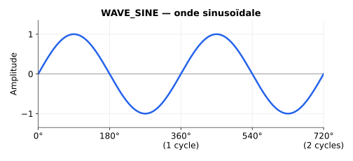
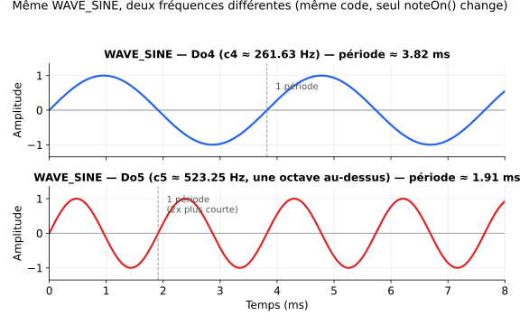
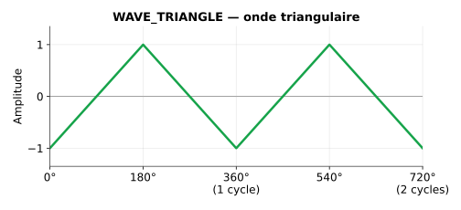
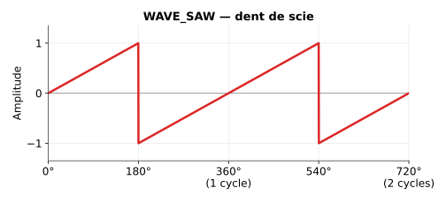
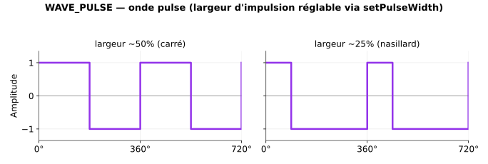
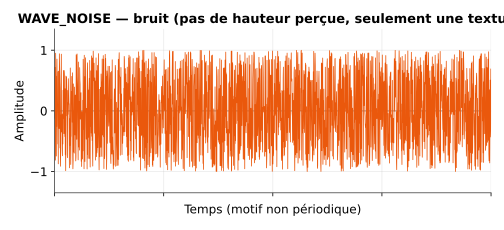

# 🌊 Exemples : formes d'onde de base et personnalisées

Couvre : `BasicWaveforms`, `SimpleWaves`, `JunoAndDX7`, `HammondB3_Leslie122`, `Virtual_Guitar`.

---

## 1. BasicWaveforms — les 5 formes d'onde fondamentales

**Dossier d'origine :** `examples/Waveforms/BasicWaveforms/`

### Ce que fait l'exemple
Joue une gamme de Do majeur en boucle avec chacune des 5 formes d'onde natives : sinus, triangle, dent de scie, pulse (carré) et bruit. Fonctionne en I2S ou sur le DAC interne (ESP32 classique uniquement).

### Code traduit

```cpp
#include <Arduino.h>
#include <ESP32Synth.h> // Inclut automatiquement ESP32SynthNotes.h

// --- CHOISIS TON MODE DE SORTIE ---
#define USE_I2S 1 // 1 pour DAC I2S, 0 pour DAC interne (ESP32 classique uniquement)

#if USE_I2S
  // --- Configuration des broches pour DAC I2S ---
  // --- Tu DOIS changer ces broches pour correspondre à ton câblage ---
  const int BCK_PIN  = 26; // Bit Clock
  const int WS_PIN   = 25; // Word Select (LRC)
  const int DATA_PIN = 22; // Data Out
#else
  // --- Configuration de broche pour DAC interne ---
  // --- Doit être GPIO 25 ou 26 sur ESP32 ---
  const int DAC_PIN = 25;
#endif

ESP32Synth synth;

// Gamme de Do majeur en CentiHertz (Hz * 100), depuis ESP32SynthNotes.h
uint32_t scale[] = {
  c4, d4, e4, f4, g4, a4, b4, c5
};

void setup() {
  Serial.begin(115200);
  Serial.println("Exemple ESP32Synth - Formes d'onde de base");
  Serial.printf("Puce ESP32 détectée : %s\n", synth.getChipModel());

  bool success;
  #if USE_I2S
    Serial.println("Initialisation de la sortie I2S...");
    success = synth.begin(BCK_PIN, WS_PIN, DATA_PIN);
  #else
    Serial.println("Initialisation de la sortie DAC...");
    #if !defined(CONFIG_IDF_TARGET_ESP32)
      Serial.println("!!! ERREUR : le DAC interne n'est disponible que sur les puces ESP32 d'origine.");
      while(1) delay(1000);
    #endif
    success = synth.begin(DAC_PIN);
  #endif

  if (!success) {
    Serial.println("!!! ERREUR : échec de l'initialisation du synthétiseur.");
    while (1) delay(1000);
  }

  synth.setMasterVolume(200); // Volume général raisonnable (0-255)
  Serial.println("Synthétiseur initialisé avec succès !");
}

void loop() {
  WaveType waves[] = { WAVE_SINE, WAVE_TRIANGLE, WAVE_SAW, WAVE_PULSE, WAVE_NOISE };
  const char* waveNames[] = { "SINUS", "TRIANGLE", "DENT DE SCIE", "PULSE", "BRUIT" };

  for (int w = 0; w < 5; w++) {
    WaveType currentWave = waves[w];
    Serial.printf("\n--- Lecture de la gamme de Do majeur en onde %s ---\n", waveNames[w]);

    // Configure une seule voix (voix 0)
    uint8_t voice = 0;
    synth.setWave(voice, currentWave);
    synth.setEnv(voice, 10, 200, 100, 300); // Attaque(ms), Decay(ms), Sustain(0-255), Release(ms)

    // Pour les ondes pulse, on fixe une largeur d'impulsion (ex. 50% de cycle de service)
    if (currentWave == WAVE_PULSE) {
      synth.setPulseWidth(voice, 128); // 0-255, où 128 = ~50%
    }

    // Joue la gamme
    for (int i = 0; i < 8; i++) {
      Serial.printf("Note : %d, Fréquence : %.2f Hz\n", i, scale[i] / 100.0f);

      // Pour le bruit, le paramètre de fréquence change son "caractère"/timbre
      // plutôt qu'une hauteur précise. On utilise une valeur fixe.
      uint32_t freqToPlay = (currentWave == WAVE_NOISE) ? 20000 : scale[i];

      synth.noteOn(voice, freqToPlay, 255); // Joue la note à pleine puissance
      delay(350);
      synth.noteOff(voice);
      delay(150); // Laisse le temps à l'enveloppe de relâchement (release)
    }

    delay(1000); // Attend une seconde avant la forme d'onde suivante
  }
}
```

### Représentation visuelle des 5 formes d'onde



L'onde la plus "pure" : un seul harmonique (la fondamentale), aucun autre. C'est le son le plus doux/rond des cinq.

> Précision : le schéma ci-dessus est **indépendant de toute fréquence précise** — l'axe horizontal est en degrés de phase (0° à 720°, soit 2 cycles génériques), pas en temps réel. Pour voir concrètement l'effet de la fréquence sur la même onde, voici Do4 (`c4`) comparé à Do5 (`c5`, une octave au-dessus) sur un axe de temps réel :



Même code (`WAVE_SINE` natif), seule la fréquence passée à `noteOn()`/`setFrequency()` change — Do5 étant une octave au-dessus de Do4, sa période est exactement deux fois plus courte (les pics sont deux fois plus rapprochés dans le temps).



Ne contient que des harmoniques impairs, avec une amplitude qui décroît très vite (en 1/n²) — un son doux, assez proche du sinus mais légèrement plus "présent".



Contient **tous** les harmoniques (pairs et impairs), avec une amplitude décroissant en 1/n — c'est l'onde la plus riche et la plus "brillante"/agressive des ondes de base, très utilisée en synthèse soustractive (basses, leads).



À gauche : largeur ~50% (cycle de service symétrique) → seulement des harmoniques impairs, son proche du triangle en plus "creux" (comme une clarinette). À droite : largeur ~25% → réintroduit des harmoniques pairs, son plus nasillard/fin. `setPulseWidth(voice, 0-255)` contrôle ce ratio en continu — c'est cette variation continue qui est exploitée dans l'effet de balayage PWM (`Square_pwm`, cf. `exemples/11_Legacy.md`).



Pas un cycle périodique : un signal aléatoire, sans hauteur perçue précise. La "fréquence" passée à `noteOn()` pour `WAVE_NOISE` influence plutôt la texture/couleur spectrale du bruit que sa hauteur (contrairement aux 4 autres ondes).

### Explications
- **`WaveType`** définit les ondes de base disponibles nativement (`WAVE_SINE`, `WAVE_TRIANGLE`, `WAVE_SAW`, `WAVE_PULSE`, `WAVE_NOISE`), sans avoir besoin de wavetable ou de callback personnalisé.
- Pour l'onde `WAVE_PULSE`, la largeur d'impulsion (`setPulseWidth`) contrôle le rapport cyclique du carré — à 128/255 (~50%) on obtient un carré "pur", à d'autres valeurs on obtient un son plus nasillard.
- Pour `WAVE_NOISE`, la "fréquence" ne détermine pas une hauteur perçue mais influence la texture/couleur du bruit.

---

## 2. SimpleWaves — 3 ondes maison + réverbération artisanale

**Dossier d'origine :** `examples/Costum Waves/SimpleWaves/`

### Ce que fait l'exemple
Définit trois oscillateurs **100% personnalisés** (`WAVE_CUSTOM`) et une réverbération globale codée à la main (technique du "tape delay" à 3 têtes de lecture), le tout branché sur `setCustomDSP()`.

### Code traduit (commentaires originaux traduits du portugais)

```cpp
#include <Arduino.h>
#include "ESP32Synth.h"

ESP32Synth synth;

// Broches I2S par défaut (modifie si nécessaire)
#define PIN_BCK  26
#define PIN_WS   25
#define PIN_DATA 22

// ==============================================================================
// 1. MOTEUR DE RÉVERBÉRATION
// ==============================================================================
#define TAPE_LEN 20000
int32_t* reverbTape = nullptr;
int writeHead = 0;

// États des filtres
int32_t lpState = 0;          // Passe-bas
int32_t dcBlockerState = 0;   // Passe-haut
int32_t dcBlockerPrevWet = 0;

void IRAM_ATTR reverbDSP(int32_t* mixBuffer, int numSamples) {
    if (!reverbTape) return;

    for (int i = 0; i < numSamples; i++) {
        int32_t dry = mixBuffer[i];

        // 1. Lectures sûres du buffer circulaire (sans utiliser l'opérateur '%')
        // On choisit des délais premiers entre eux, inférieurs à TAPE_LEN (20000)
        int tap1 = writeHead - 4327;  if (tap1 < 0) tap1 += TAPE_LEN;
        int tap2 = writeHead - 11003; if (tap2 < 0) tap2 += TAPE_LEN;
        int tap3 = writeHead - 19013; if (tap3 < 0) tap3 += TAPE_LEN;

        // Somme les 3 têtes et divise par 4 (>> 2) pour ne pas saturer
        int32_t wet = (reverbTape[tap1] >> 2) + (reverbTape[tap2] >> 2) + (reverbTape[tap3] >> 2);

        // 2. DC Blocker (filtre passe-haut crucial !)
        // Élimine toute énergie stagnante qui provoquerait une boucle infinie de bruit.
        int32_t dcBlocked = wet - dcBlockerPrevWet + ((dcBlockerState * 253) >> 8);
        dcBlockerPrevWet = wet;
        dcBlockerState = dcBlocked;

        // 3. Filtre passe-bas (assourdit progressivement les répétitions)
        lpState = ((dcBlocked * 50) + (lpState * 206)) >> 8;

        // 4. Calcule le feedback à écrire sur la "bande" (~78% de feedback)
        int32_t feedback = (dry >> 1) + ((lpState * 200) >> 8);

        // 5. SATURATION ANALOGIQUE (soft-clipping de sécurité)
        // Si les calculs tentent de dépasser, on écrase le son à la limite du 16 bits.
        if (feedback > 32767) feedback = 32767;
        else if (feedback < -32768) feedback = -32768;

        // Écrit sur la "bande" et avance
        reverbTape[writeHead] = feedback;
        writeHead++;
        if (writeHead >= TAPE_LEN) writeHead = 0;

        // Mixage master
        mixBuffer[i] = dry + lpState;
    }
}

// ==============================================================================
// 2. LES 3 ONDES PERSONNALISÉES (WAVE_CUSTOM)
// ==============================================================================

// ONDE 1 : SINUS REPLIÉ (avec Drive agressif)
void IRAM_ATTR waveFoldedSine(Voice* vo, int32_t* mixBuffer, int samples, int32_t startEnv, int32_t envStep) {
    int32_t currentEnv = startEnv;
    int32_t volBase = ((uint32_t)vo->vol * vo->trmModGain) >> 8;
    uint32_t ph = vo->phase;
    uint32_t inc = vo->phaseInc + vo->vibOffset;

    for (int i = 0; i < samples; i++) {
        int32_t rawSine = sineLUT[ph >> SINE_SHIFT];
        int32_t s = rawSine >> 15; // Rend le volume de base plus élevé (~32000)

        // DRIVE ! Multiplie par 4 avant de heurter le plafond.
        s = s * 4;

        // VRAI WAVEFOLDING : ça dépasse le plafond ? on rebondit vers le bas.
        // Ça dépasse le plancher ? on rebondit vers le haut.
        int32_t limit = 20000;
        while(s > limit || s < -limit) {
            if (s > limit) s = (limit << 1) - s;
            else if (s < -limit) s = -(limit << 1) - s;
        }

        int32_t finalVol = (int32_t)(((uint32_t)(currentEnv >> 12) * volBase) >> 16);
        mixBuffer[i] += (s * finalVol) >> 16;
        ph += inc;
        currentEnv += envStep;
    }
    vo->phase = ph;
}

// ONDE 2 : TRIANGLE EN ESCALIER (bitcrush manuel — hauteur parfaite, marches
// agressives, ZÉRO sifflement !)
void IRAM_ATTR waveSteppedTri(Voice* vo, int32_t* mixBuffer, int samples, int32_t startEnv, int32_t envStep) {
    int32_t currentEnv = startEnv;
    int32_t volBase = ((uint32_t)vo->vol * vo->trmModGain) >> 8;
    uint32_t ph = vo->phase;
    uint32_t inc = vo->phaseInc + vo->vibOffset;

    for (int i = 0; i < samples; i++) {
        // 1. Génère un triangle mathématiquement parfait (pour ne pas perdre l'accordage et ne pas siffler)
        int16_t saw = (int16_t)(ph >> 16);
        int32_t s = (int16_t)(((saw ^ (saw >> 15)) * 2) - 32767);

        // 2. LA MAGIE DU CHIPTUNE : bitcrush d'amplitude (4 bits)
        // Le ">> 12" jette les informations douces de l'onde, et le "<< 12" ramène au volume normal.
        // Résultat : des marches dures et purement rétro !
        s = (s >> 12) << 12;

        int32_t finalVol = (int32_t)(((uint32_t)(currentEnv >> 12) * volBase) >> 16);
        mixBuffer[i] += (s * finalVol) >> 16;
        ph += inc;
        currentEnv += envStep;
    }
    vo->phase = ph;
}

// ONDE 3 : SINUS FM AVEC FEEDBACK (métallique, musical, sans devenir du bruit blanc)
void IRAM_ATTR waveFMSine(Voice* vo, int32_t* mixBuffer, int samples, int32_t startEnv, int32_t envStep) {
    int32_t currentEnv = startEnv;
    int32_t volBase = ((uint32_t)vo->vol * vo->trmModGain) >> 8;
    uint32_t ph = vo->phase;
    uint32_t inc = vo->phaseInc + vo->vibOffset;

    int16_t prevOut = vo->noiseSample;

    for (int i = 0; i < samples; i++) {
        // On réduit le décalage à 15 !
        // Le feedback déforme désormais l'onde d'environ 12% (point de résonance musicale parfait)
        uint32_t modPh = ph + ((int32_t)prevOut << 15);

        int32_t s = sineLUT[(modPh >> SINE_SHIFT) & SINE_LUT_MASK] >> 16;
        prevOut = (int16_t)s;

        int32_t finalVol = (int32_t)(((uint32_t)(currentEnv >> 12) * volBase) >> 16);
        mixBuffer[i] += (s * finalVol) >> 16;
        ph += inc;
        currentEnv += envStep;
    }
    vo->phase = ph;
    vo->noiseSample = prevOut;
}

// ==============================================================================
// 3. SETUP & LOOP
// ==============================================================================

void setup() {
    Serial.begin(115200);

    // 1. Alloue les 80 Ko de RAM pour la bande de réverbération, en sécurité sur le tas (heap)
    reverbTape = (int32_t*)malloc(TAPE_LEN * sizeof(int32_t));
    if (reverbTape != nullptr) {
        memset(reverbTape, 0, TAPE_LEN * sizeof(int32_t));
        Serial.println("Bande de réverbération allouée avec succès !");
    } else {
        Serial.println("ERREUR FATALE : pas assez de RAM pour la réverbération !");
        while(1);
    }

    // 2. Démarre le Synth
    if (!synth.begin(4,15,2,I2S_32BIT)) {
        Serial.println("Échec du démarrage de l'i2s !");
        while(1);
    }

    // 3. Attache la réverbération à la fin du mixage
    synth.setCustomDSP(reverbDSP);

    // 4. Configure les 3 voix pour utiliser nos fonctions personnalisées
    synth.setCustomWave(0, waveFoldedSine);
    synth.setCustomWave(1, waveSteppedTri);
    synth.setCustomWave(2, waveFMSine);

    // 5. Configure les enveloppes pour bien sonner (A, D, S, R)
    synth.setEnv(0, 10,  300, 100, 1500); // Pluck doux
    synth.setEnv(1, 0,   0, 255,   200);  // Arpège court (chiptune)
    synth.setEnv(2, 500, 500, 200, 3000); // Nappe (pad) sombre et longue

    // Volume général
    synth.setMasterVolume(255); // Un peu réduit car ces ondes sont riches
}

void loop() {
    // Voix 0 (Sinus replié) - Basse profonde
    synth.noteOn(0, c2, 200);
    delay(2000);
    synth.noteOff(0);
    delay(4000);

    // Voix 1 (Triangle en escalier) - Arpège aigu chiptune
    synth.setArpeggio(1, 25, c4, ds4, g4, c5);
    synth.noteOn(1, c4, 100);
    delay(2000);
    synth.noteOff(1);
    delay(4000);

    // Voix 2 (FM avec feedback) - Nappe métallique qui déchire le fond sonore
    synth.noteOn(2, c3, 180);
    delay(2000);
    synth.noteOff(2);
    delay(4000);

    // Les trois voix ensemble
    synth.noteOn(0, c2, 200);
    synth.setArpeggio(1, 25, c4, ds4, g4, c5);
    synth.noteOn(1, c4, 100);
    synth.noteOn(2, c3, 180);

    delay(2000);

    synth.noteOff(0);
    synth.noteOff(1);
    synth.noteOff(2);

    delay(4000); // Le temps de profiter de la traîne infinie de la réverbération
}
```

### Explications
- Le buffer de réverbération (`reverbTape`) est un immense tableau circulaire de 20 000 échantillons alloué dynamiquement (`malloc`), lu à 3 "têtes" différentes (délais premiers entre eux pour éviter les résonances périodiques audibles), puis renvoyé dans le mixage avec du feedback filtré.
- Le **DC Blocker** (filtre passe-haut) est essentiel : sans lui, la boucle de feedback peut accumuler une composante continue et finir en larsen numérique.
- Les trois formes d'onde personnalisées montrent trois techniques différentes de synthèse "faite main" : *wavefolding* (repliement), *bitcrush* d'amplitude (façon chiptune 8-bit), et FM à feedback (façon opérateur Yamaha DX7 en mode "feedback loop").

---

## 3. JunoAndDX7 — 8 moteurs de synthèse classiques en O(1)

**Dossier d'origine :** `examples/Costum Waves/JunoAndDX7/`

### Ce que fait l'exemple
Recrée, via des callbacks `WAVE_CUSTOM`, six synthés emblématiques :
1. **Roland Juno** — dent de scie principale + sous-oscillateur carré à -1 octave.
2. **Yamaha DX7 E-Piano** — FM dynamique 2 opérateurs.
3. **Yamaha DX7 Tubular Bells** — FM inharmonique (ratio 3,5) avec décroissance exponentielle.
4. **String Ensemble** — supersaw à 3 oscillateurs désaccordés.
5. **Prophet-5 Hard Sync** — synchronisation matérielle (hard sync) avec balayage dynamique.
6. **Cybernetic Bass** — basse FM moderne façon "Serum".

### Extrait traduit (moteur Juno + boucle principale)

```cpp
// ESP32Synth - Vitrine des ondes personnalisées
// 8 moteurs de synthèse O(1) personnalisés utilisant le buffer dédié cw[6].
// Matériel : ESP32 ou ESP32-S3, PCM5102A (I2S_32BIT)

#include <Arduino.h>
#include "ESP32Synth.h"

ESP32Synth synth;

// ====================================================================================
// 1. Roland Juno (dent de scie principale + sous-oscillateur carré -1 octave)
// ====================================================================================
void IRAM_ATTR renderJuno(Voice* vo, int32_t* mixBuffer, int samples, int32_t startEnv, int32_t envStep) {
    int32_t currentEnv = startEnv; int32_t volBase = ((uint32_t)vo->vol * vo->trmModGain) >> 8;
    uint32_t ph = vo->phase; uint32_t inc = vo->phaseInc;
    uint32_t subPh = vo->cw[0]; uint32_t subInc = inc >> 1; // cw[0] utilisé pour la sous-phase

    if (envStep == 0) {
        int32_t envSafe = currentEnv >> 14; envSafe &= ~(envSafe >> 31);
        int32_t finalVol = (int32_t)((envSafe * volBase) >> 14);
        if (finalVol == 0) { vo->phase += inc*samples; vo->cw[0] += subInc*samples; return; }

        for (int i = 0; i < samples; i++) {
            int16_t saw = (int16_t)(ph >> 16);
            int16_t sub = (subPh >> 31) ? 32767 : -32767;
            mixBuffer[i] += (((saw >> 1) + (sub >> 1)) * finalVol) >> 16;
            ph += inc; subPh += subInc;
        }
    } else {
        for (int i = 0; i < samples; i++) {
            int32_t envSafe = currentEnv >> 14; envSafe &= ~(envSafe >> 31);
            int32_t finalVol = (int32_t)((envSafe * volBase) >> 14);
            int16_t saw = (int16_t)(ph >> 16);
            int16_t sub = (subPh >> 31) ? 32767 : -32767;
            mixBuffer[i] += (((saw >> 1) + (sub >> 1)) * finalVol) >> 16;
            ph += inc; subPh += subInc; currentEnv += envStep;
        }
    }
    vo->phase = ph; vo->cw[0] = subPh;
}

// [... les fonctions renderDX7, renderFMBell, renderStrings, renderHardSync,
//      renderCyberBass suivent exactement le même schéma : phase + registres cw[] ...]

// ====================================================================================
// CONFIGURATION ET EXÉCUTION
// ====================================================================================

void setup() {
    Serial.begin(115200);
    delay(500);

    #if defined(CONFIG_IDF_TARGET_ESP32S3)
        bool started = synth.begin(4, 6, 5, I2S_32BIT);
    #else
        bool started = synth.begin(4, 15, 2, I2S_32BIT);
    #endif

    if (started) Serial.println("ESP32Synth : moteur ultime 100% en ligne.");

    synth.setMasterVolume(110);
}

void playChord(uint32_t n1, uint32_t n2, uint32_t n3, SynthCustomWaveCallback waveCB,
               uint16_t a, uint16_t d, uint8_t s, uint16_t r) {
    for(int i = 0; i < 3; i++) {
        synth.setCustomWave(i, waveCB);
        synth.setEnv(i, a, d, s, r);
    }
    synth.noteOn(0, n1, 150); synth.noteOn(1, n2, 150); synth.noteOn(2, n3, 150);
    delay(1800);
    synth.noteOff(0); synth.noteOff(1); synth.noteOff(2);
    delay(r + 200);
}

void loop() {
    Serial.println(">>> 1. Roland Juno (dent de scie + sous-osc)");
    playChord(c4, e4, g4, renderJuno, 10, 500, 150, 400);
    delay(500);

    Serial.println(">>> 2. Yamaha DX7 E-Piano (pluck FM)");
    playChord(a3, c4, e4, renderDX7, 5, 800, 20, 600);
    delay(500);

    Serial.println(">>> 3. Yamaha DX7 Tubular Bells (FM inharmonique)");
    playChord(c5, fs5, a5, renderFMBell, 5, 1200, 0, 1000);
    delay(500);

    Serial.println(">>> 4. String Ensemble (supersaw)");
    playChord(f3, a3, c4, renderStrings, 500, 0, 255, 800);
    delay(500);

    Serial.println(">>> 5. Prophet-5 Hard Sync Lead (balayage d'enveloppe dynamique)");
    playChord(d3, d4, a4, renderHardSync, 100, 800, 40, 500);
    delay(500);

    Serial.println(">>> 6. Cybernetic Bass (basse moderne façon Serum)");
    playChord(c2, c3, g3, renderCyberBass, 1, 1000, 0, 400);
    delay(1000);
}
```

### Explications
- Cet exemple est une excellente référence pour apprendre à écrire des callbacks `WAVE_CUSTOM` efficaces : chaque moteur exploite les 6 registres `cw[]` de la voix pour stocker un second oscillateur (sous-oscillateur, modulateur FM, oscillateur "esclave" en hard-sync...).
- Remarque le motif récurrent : une **branche rapide `if (envStep == 0)`** qui évite de recalculer l'enveloppe à chaque échantillon quand elle est constante (optimisation), et une branche générale sinon.
- La fonction `playChord()` factorise l'assignation du callback + de l'enveloppe sur 3 voix, pour jouer un accord avec le timbre voulu.

---

## 4. HammondB3_Leslie122 — Orgue Hammond avec cabinet Leslie modélisé physiquement

**Dossier d'origine :** `examples/Costum Waves/HammondB3_Leslie122/`

### Ce que fait l'exemple
Un exemple avancé (545 lignes) qui simule :
1. Synthèse additive à 9 tirettes (*drawbars*) en 64 bits, linéaire et haute précision (sans bitcrush ni clics de phase).
2. Un cabinet Leslie 122 modélisé physiquement avec **deux rotors indépendants** (pavillon aigu + tambour grave), chacun avec son propre LFO.
3. Une émulation d'**inertie mécanique** (glissement de courroie) pendant les accélérations/décélérations lentes vers rapides des rotors.
4. Une réverbération de Schroeder (filtre en peigne à feedback amorti, LBCF) pour éviter les résonances métalliques.
5. Un *DC blocker* rapide (15 ms) pour garder le signal parfaitement centré.

### Points clés du code (broches et état des rotors)

```cpp
// GCC : indices pour l'optimisation du prédicteur de branchement
#ifndef LIKELY
#define LIKELY(x) __builtin_expect(!!(x), 1)
#endif
#ifndef UNLIKELY
#define UNLIKELY(x) __builtin_expect(!!(x), 0)
#endif

// ====================================================================================
// CONFIGURATION MATÉRIELLE ET BROCHAGE
// ====================================================================================
#if defined(CONFIG_IDF_TARGET_ESP32S3)
  #define I2S_BCK  4
  #define I2S_WS   6
  #define I2S_DATA 5
#else
  #define I2S_BCK  4
  #define I2S_WS   15
  #define I2S_DATA 2
#endif

ESP32Synth synth;

// ====================================================================================
// VALEURS GLOBALES DES TIRETTES DE L'ORGUE (DRAWBARS)
// ====================================================================================
volatile uint8_t organDrawbars[9] = {255, 255, 255, 0, 0, 0, 0, 0, 0};
volatile uint8_t targetDrawbars[9] = {255, 255, 255, 0, 0, 0, 0, 0, 0};

// ====================================================================================
// ÉTATS ET PARAMÈTRES DU LESLIE 122 À DOUBLE ROTOR (PROTÉGÉ EN INT32 SIGNÉ)
// ====================================================================================
// Vitesses en Hz * 100 (Choral vs Trémolo)
// Pavillon aigu (Horn) : Lent = 0.8Hz (80), Rapide = 6.9Hz (690)
// Tambour grave (Drum) : Lent = 0.7Hz (70), Rapide = 5.7Hz (570)
volatile int32_t targetHornSpeed = 80;
volatile int32_t targetDrumSpeed = 70;

volatile int32_t currentHornSpeed = 80;
volatile int32_t currentDrumSpeed = 70;

volatile int32_t organLeslieTremoloDepthHorn = 80;
volatile int32_t organLeslieTremoloDepthDrum = 60;
```

### Explications
- Les **9 tirettes** (`organDrawbars[9]`) correspondent exactement au fonctionnement d'un vrai Hammond B3 : chaque tirette ajoute un harmonique de la note jouée (fondamentale, sous-harmonique, octaves, quinte...) avec un volume réglable de 0 à 255. C'est un exemple typique de **synthèse additive**.
- Le Leslie 122 simulé n'est pas un simple LFO de trémolo : les vitesses `currentHornSpeed`/`currentDrumSpeed` **glissent progressivement** vers leur cible (`targetHornSpeed`/`targetDrumSpeed`) pour simuler l'inertie mécanique réelle du moteur qui entraîne le pavillon rotatif — c'est ce qui donne le fameux effet "montée en régime" caractéristique du Leslie quand on bascule entre vitesse lente (choral) et rapide (tremolo).
- Le fichier complet va beaucoup plus loin (réverbération de Schroeder, DC blocker rapide) ; consulte `src/../examples/Costum Waves/HammondB3_Leslie122/HammondB3_Leslie122.ino` pour l'intégralité si tu veux l'étudier en détail — c'est l'un des exemples les plus riches du projet en termes de modélisation.

---

## 5. Virtual_Guitar — Guitare à modélisation physique (Karplus-Strong étendu) + pédalier virtuel

**Dossier d'origine :** `examples/Costum Waves/Virtual_Guitar/`

### Ce que fait l'exemple
Construit un moteur de corde par **synthèse Karplus-Strong étendue (EKS)** entièrement dans un callback `WAVE_CUSTOM`, plus une chaîne DSP master complète en temps réel :
- Résonateur acoustique de Helmholtz,
- Compresseur VCA (suiveur d'enveloppe),
- Overdrive à lampes avec écrêtage asymétrique,
- Simulateur de baffle 4×12 (filtre IIR 3 pôles),
- Chorus analogique et delay type bande magnétique.

### Extrait traduit (initialisation du moteur de cordes)

```cpp
/**
 * @file      Virtual_Guitar.ino
 * @author    Danilo Gabriel
 * @brief     Guitare à modélisation physique avancée et pédalier virtuel
 *
 * Cet exemple démontre les capacités DSP extrêmes de la bibliothèque ESP32Synth.
 * Plutôt que d'utiliser des oscillateurs standards, il construit un moteur de
 * synthèse de corde Karplus-Strong étendu (EKS) entièrement à l'intérieur d'un
 * callback d'onde personnalisée.
 *
 * Il propose aussi une chaîne DSP Master complète tournant en temps réel :
 * - Résonateur acoustique de Helmholtz
 * - Compresseur VCA (suiveur d'enveloppe)
 * - Overdrive à lampes avec écrêtage asymétrique
 * - Simulateur de baffle 4x12 (filtre IIR 3 pôles)
 * - Chorus analogique et delay type bande
 *
 * Matériel : nécessite un DAC I2S (ex. PCM5102A) pour une fidélité audio 32 bits.
 */

#pragma GCC optimize("O3,unroll-loops")

#include <Arduino.h>
#include "ESP32Synth.h"
#include "ESP32SynthNotes.h"
#include <esp_heap_caps.h>

#if defined(CONFIG_IDF_TARGET_ESP32S3)
#define I2S_BCK_PIN  4
#define I2S_WS_PIN   6
#define I2S_DATA_PIN 5
#else
#define I2S_BCK_PIN  4
#define I2S_WS_PIN   15
#define I2S_DATA_PIN 2
#endif

ESP32Synth synth;

// ====================================================================================
// 1. MOTEUR KARPLUS-STRONG ÉTENDU
// ====================================================================================
#define MAX_GUITAR_STRINGS 8
#define KS_BUFFER_SIZE 2048 // Puissance de 2 : évite le désaccordage sur les basses fréquences

static int16_t** ks_delay_lines = nullptr;
static Voice*    active_string_ptrs[MAX_GUITAR_STRINGS] = {nullptr};

void IRAM_ATTR renderGuitarVoice(Voice* vo, int32_t* mixBuffer, int samples, int32_t startEnv, int32_t envStep) {
    int stringIdx = -1;
    for (int i = 0; i < MAX_GUITAR_STRINGS; i++) {
        if (active_string_ptrs[i] == vo) { stringIdx = i; break; }
        if (active_string_ptrs[i] == nullptr) { active_string_ptrs[i] = vo; stringIdx = i; break; }
    }
    if (stringIdx == -1) stringIdx = 0;

    int16_t* __restrict__ delayLine = ks_delay_lines[stringIdx];

    // cw[0] : indicateur d'initialisation | cw[1] : période | cw[2] : index | cw[3] : dernier échantillon
    if (vo->cw[0] == 0) {
        uint32_t period = (4800000 / vo->freqVal); // ... suite du remplissage de la ligne à retard avec du bruit
        // (la suite construit l'impulsion initiale façon "pincement de corde", puis fait
        //  vieillir cette impulsion en la filtrant en boucle : c'est le principe même
        //  de l'algorithme de Karplus-Strong)
    }
}
```

Note : `#ifdef (CONFIG_IDF_TARGET_ESP32S3)` avec des parenthèses n'est en réalité **pas valide en C préprocesseur standard** — `#ifdef` attend un simple nom de macro, pas une expression entre parenthèses (c'est `#if defined(...)` qu'il faut utiliser, comme fait correctement dans les autres exemples). C'est une petite coquille présente dans le fichier source d'origine.

### Explications
- **Karplus-Strong** est un algorithme de modélisation physique très économe : on remplit une ligne à retard (buffer circulaire) avec du bruit au moment du pincement de la corde, puis on la fait "vieillir" en la filtrant à chaque tour de boucle (moyenne glissante), ce qui simule naturellement l'amortissement d'une corde réelle. Le fait de stocker une ligne à retard **par corde active** (`ks_delay_lines[stringIdx]`) permet de jouer plusieurs cordes simultanément (accords).
- La chaîne d'effets globale (Helmholtz, compresseur, overdrive, simulateur de baffle, chorus, delay) s'attache typiquement via `setCustomDSP()` sur le bus de mixage final, en complément du moteur de corde qui, lui, tourne voix par voix via `setCustomWave()`.
- C'est l'exemple le plus proche d'un « vrai pédalier de guitare virtuel » du projet — à étudier si tu veux construire tes propres effets de chaîne (guitare, basse, etc.).
